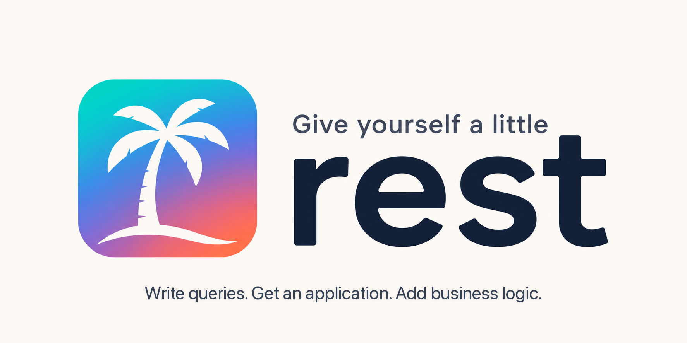

# REST

<p align="center">
  
</p>

[](https://github.com/repomz/rest/actions/workflows/ci.yml)
[](https://go.dev/)
[](https://sqlc.dev/)
[](LICENSE)

`rest` is a Go application generator inspired by [sqlc](https://github.com/sqlc-dev/sqlc). SQLC turns SQL into type-safe Go code; `rest` takes the next step and turns SQLC output or MongoDB contracts into a runnable REST application.

Here's how it works:

1. You describe data access with SQLC/PostgreSQL files or MongoDB YAML contracts.
2. You run `rest gen`.
3. You get a layered Go REST application with repositories, services, HTTP handlers, OpenAPI, auth/RBAC, Docker, tests, and production-oriented middleware.

For SQL projects, `rest` reads SQL schemas, SQLC queries, and generated Go code, then creates domain models, repositories, services, HTTP transport, OpenAPI, Docker, logging, metrics, security middleware, tests, and curl examples. For MongoDB projects, it reads `rest_config/rest_mongo/*.yaml` contracts and generates a layered MongoDB HTTP API with custom methods, OpenAPI documentation, auth/security middleware, and Docker output.

## Requirements

Required:

- Go 1.24 or newer.

Required for SQL projects:

- [`sqlc`](https://github.com/sqlc-dev/sqlc): `go install github.com/sqlc-dev/sqlc/cmd/sqlc@latest`.

Required for running generated applications:

- PostgreSQL for SQL projects.
- MongoDB for Mongo projects.

Optional but recommended:

- Docker, when `docker.enabled` or `docker.compose.enabled` is used.
- `govulncheck`, used by repository CI through `make vuln`.

## Installation

```bash
go install github.com/repomz/rest/cmd/rest@latest
```

The binary is installed into `$(go env GOPATH)/bin`. Make sure this directory is included in your `PATH`.

Verify the installation:

```bash
rest version
```

Install a specific release:

```bash
go install github.com/repomz/rest/cmd/rest@v0.1.0
```

Update an existing installation:

```bash
rest update
```

After installing the release, the command prints its GitHub Release notes,
including breaking changes, features, fixes, and documentation updates.
Release entries in [`CHANGELOG.md`](CHANGELOG.md) are generated automatically
from Conventional Commits.

## Quick Start

Generate a standalone SQL example project:

```bash
rest init --example sql
rest gen
go test ./...
```

Generate a standalone MongoDB example project:

```bash
rest init --example mongo
rest gen
go test ./...
```

Use an existing SQLC project:

```bash
rest init
# Set enable: enable and a valid sqlc_path in rest_config/rest_sqlc.yaml.
rest gen
```

When `rest init` runs in an interactive terminal, it briefly checks whether a newer CLI release is available. If an update exists, it asks whether to install it first. Declining the update, running non-interactively, or having no network access does not block initialization.

## Commands

| Command | Description |
| --- | --- |
| `rest init` | Create `rest_config/*.yaml` and a customizable `rest_sqlc/` project skeleton |
| `rest init --example sql` | Create a standalone `rest_sqlc_example/` project |
| `rest init --example mongo` | Create a standalone MongoDB example contract |
| `rest gen` | Generate the REST application |
| `rest doctor` | Validate configs, generated files, tooling, Docker/OpenAPI/auth readiness |
| `rest list endpoints` | Print the currently discovered endpoints with source and access policy |
| `rest update` | Update the CLI from GitHub Releases |
| `rest update --check` | Check whether a newer CLI release is available without installing it |
| `rest changelog` | Print the latest GitHub Release notes |
| `rest changelog --version vX.Y.Z` | Print notes for a specific release |
| `rest version` | Print the installed version |

For SQL projects, `rest gen` runs:

```bash
sqlc generate -f <sqlc_path>
go mod tidy
```

Install SQLC with:

```bash
go install github.com/sqlc-dev/sqlc/cmd/sqlc@latest
```

To run SQLC manually, set `auto_sqlc: disable` in `rest_config/rest.yaml`, execute `sqlc generate -f <sqlc_path>`, and then run `rest gen`.

For MongoDB projects, `rest gen` reads active `rest_config/rest_mongo/*.yaml` contracts, ignoring system files that start with `rest_`, and generates a layered MongoDB API: domain documents, Mongo repositories, services, HTTP handlers, custom method routes, OpenAPI, and optional Docker/Docker Compose output.

Use `rest doctor` before or after `rest gen` to catch common setup issues: invalid YAML, unknown fields, missing enabled configs, broken SQLC/Mongo contract paths, missing `DB_DSN` or `MONGO_URI`, auth policy conflicts, Docker daemon availability, OpenAPI output gaps, and generated-project readiness.

Use `rest list endpoints` to inspect the API surface that `rest` currently discovers from SQLC, Mongo contracts, system routes, and auth configuration.

### Troubleshooting generator issues

Start with:

```bash
rest doctor
```

`rest doctor` validates the generator workspace and explains how to fix common problems: missing `rest_config`, invalid YAML, unknown fields, missing `sqlc`, broken SQLC paths, Mongo contract mistakes, auth policy conflicts, Docker daemon availability, missing runtime environment variables, and OpenAPI output gaps.

Most CLI errors also include a short hint. For example, `sqlc not found` suggests the install command, YAML errors point back to `rest_config`, Docker daemon errors suggest checking `docker info`, and auth policy conflicts explain which endpoint policy must be fixed.

### Authentication and authorization

Set `auth: enable` in `rest_config/rest.yaml`. The first `rest gen` generates the application and creates `rest_config/auth_rest.yaml` with every discovered SQL and Mongo endpoint. Choose JWT authentication or Basic Auth, configure `public`, `require_auth`, and `roles`, then run `rest gen` again to generate authentication and RBAC route guards. For SQL JWT projects, generated auth handlers issue HS256 tokens. For Mongo projects, generated middleware validates JWT bearer tokens or Basic Auth credentials and applies endpoint role policies. New endpoints are merged into the auth file without losing existing policies.

When REST, SQLC, Mongo, schema, query, and auth configuration inputs have not changed, `rest gen` exits without regenerating code.

### Security hardening

Generated SQL and Mongo apps include configurable HTTP hardening under `http.middleware`: security headers, per-client-IP rate limiting, recovery, request IDs, max body size, and CORS. The canonical CORS defaults use explicit origins instead of `*`; set your production origins in `rest_config/rest.yaml`.

## Generated Application

```text
cmd/main.go
internal/app/domain
internal/app/repository/pgrepo
internal/app/services
internal/app/transport/httpmodels
internal/app/transport/httpserver
```

MongoDB projects generate the same application layout with generic BSON document domain types, collection-specific repositories, services, HTTP handlers, custom method handlers, swagger routes, and optional auth middleware.

Optional output includes `Dockerfile`, `docker-compose.yml`, `.env.example`, `Makefile`, `docs/swagger.yaml`, `DEPLOYMENT.md`, GitHub Actions workflows, curl examples, logging, metrics, and a Goose initialization migration where supported by the selected backend.

Files under `internal/app/*` are regenerated by `rest gen`. With `safe_reload` enabled, REST detects user changes and asks whether each modified file should be kept or overwritten.

## Release trust

`rest update` downloads the platform-specific release archive and `checksums.txt`, verifies the archive SHA-256, and only then replaces the local binary. `rest update --check` only reports whether a newer version is available; it never installs files.

## Development

```bash
make setup
gofmt -w .
make check
make race
make vuln
make generated-examples
make golden
REST_DOCKER_SMOKE=1 make docker-smoke # requires Docker
REST_RUNTIME_E2E=1 make runtime-e2e # requires live Postgres, MongoDB, and sqlc
```

Use Conventional Commit messages such as
`feat(update): show download progress`. See
[`CONTRIBUTING.md`](CONTRIBUTING.md) for the project workflow. Release automation
is implemented by [`scripts/release.sh`](scripts/release.sh),
[`scripts/publish-release.sh`](scripts/publish-release.sh), and the GitHub
Actions workflows in [`.github/workflows`](.github/workflows).

Run the representative 10/50-table generator benchmark:

```bash
make benchmark
```

Pull requests should stay focused, include tests for new generator behavior, and update documentation when CLI, configuration, or generated output changes.

## License

Licensed under the [Apache License 2.0](LICENSE).
