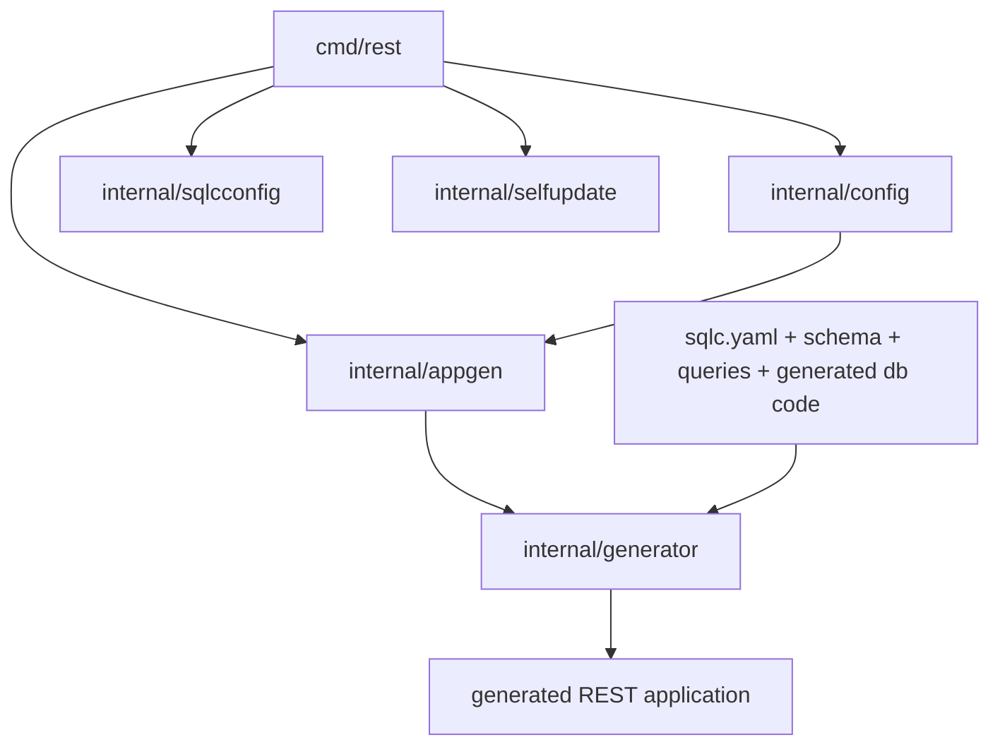
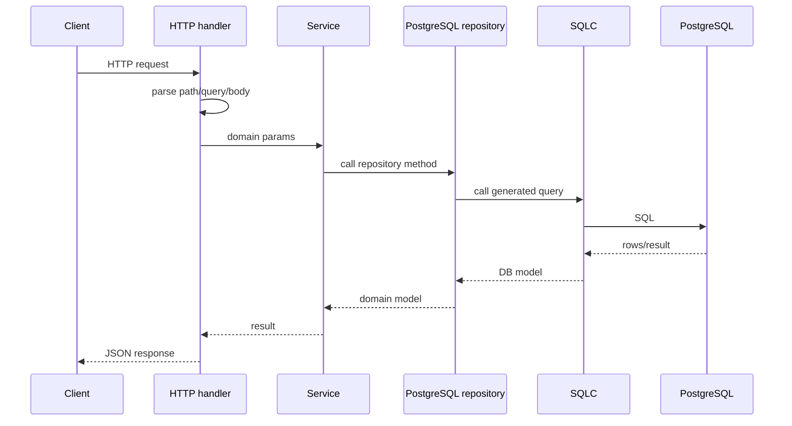

# Архитектура Проекта

Документ описывает, как устроен `rest_generator`, за что отвечают основные файлы и как данные проходят путь от конфигурации и SQLC-источников до сгенерированного REST-приложения.

## Общая Картина

`rest_generator`: CLI-приложение. Основной workflow:

1. `rest init` создает редактируемую конфигурацию проекта.
2. `rest generate` читает `rest_config/*.yaml`, `sqlc/sqlc.yaml`, SQL schema/query files и Go-файлы, созданные SQLC.
3. Генератор строит внутреннюю модель таблиц, query methods, параметров, endpoint-ов и включенных features.
4. Затем рендерит Go-код приложения и дополнительные артефакты.



## Структура Репозитория

```text
cmd/rest
internal/appgen
internal/config
internal/config/templates
internal/generator
internal/selfupdate
internal/sqlcconfig
internal/sqlcconfig/templates
docs
.github/workflows
```

## CLI Layer

### `cmd/rest/main.go`

Entrypoint исполняемого файла `rest`.

Отвечает за:

- parsing top-level команд;
- dispatch в init, generate, update и version handlers;
- тонкий CLI-слой без тяжелой бизнес-логики;
- переменную `version`, которую release-сборка заполняет через `-ldflags`.

Команды:

| Команда | Где реализована |
| --- | --- |
| `rest init` | `runInit`, `parseInitOptions` |
| `rest generate` | `runGenerate`, `parseConfigDir` |
| `rest update` | `runUpdate`, `parseUpdateOptions`, `internal/selfupdate` |
| `rest version` | печатает `main.version` |

`runInit` умеет создавать:

- только config-файлы REST Generator;
- config-файлы плюс минимальный SQLC-проект;
- config-файлы, SQLC-проект и пример schema/query.

`runGenerate` создает `appgen.Generator` с default feature registry и запускает генерацию.

`runUpdate` вызывает self-updater, который проверяет GitHub Releases и заменяет текущий binary.

### `cmd/rest/main_test.go`

Тестирует CLI option parsing и режимы `init`. Эти тесты удерживают поведение CLI стабильным при развитии проекта.

## Configuration Layer

### `internal/config/types.go`

Содержит Go-структуры, соответствующие YAML-конфигам:

- `Rest` для `rest.yaml`;
- `SQL` для `sqlc_rest.yaml`;
- MongoDB и auth contracts для будущих генераторов;
- nested structs для HTTP, Docker, OpenAPI, logging, metrics, testing, project support files и database connection settings.

Boolean-like значения описаны в `internal/config/value.go`.

### `internal/config/value.go`

Реализует гибкие YAML-переключатели:

```text
true, false, enable, disable, enabled, disabled, on, off, yes, no
```

Так конфиги остаются читаемыми, но в Go попадают строгие значения.

### `internal/config/load.go`

Загружает конфигурацию проекта.

Важные детали:

- всегда читает `rest.yaml`;
- читает `sqlc_rest.yaml` только если `rest.sql` включен;
- использует `yaml.Decoder.KnownFields(true)`, поэтому неизвестные YAML-поля становятся ошибкой;
- сохраняет fallback для legacy password field в SQL connection settings.

### `internal/config/generate.go`

Создает initial config files из embedded templates.

Отвечает за:

- обход embedded YAML templates из `internal/config/templates`;
- включение SQLC в `sqlc_rest.yaml` для `rest init --sqlc`;
- отказ перезаписывать существующие config-файлы;
- создание target config directory и запись YAML.

### `internal/config/templates/*.yaml`

Канонические YAML-файлы, встроенные в бинарник `rest`:

| Файл | Назначение |
| --- | --- |
| `rest.yaml` | Основной project, HTTP, Docker, OpenAPI, logging, metrics, testing и feature switches |
| `sqlc_rest.yaml` | SQLC/PostgreSQL generator settings |
| `mongo_rest.yaml` | Контракт будущего MongoDB generator |
| `auth_rest.yaml` | Контракт будущего auth generator |

### `internal/config/templates/templates.go`

Объявляет `go:embed` filesystem для YAML-шаблонов.

## SQLC Skeleton Layer

### `internal/sqlcconfig/generate.go`

Создает стартовые SQLC-файлы и example-файлы.

Отвечает за:

- embed `internal/sqlcconfig/templates/project`;
- embed `internal/sqlcconfig/templates/example`;
- планирование output paths;
- проверку, что target files еще не существуют;
- запись SQLC skeleton или example files.

### `internal/sqlcconfig/templates/project`

Минимальная SQLC-структура:

```text
sqlc/sqlc.yaml
sqlc/schema/item.sql
sqlc/queries/item.sql
```

### `internal/sqlcconfig/templates/example`

Более полный пример:

```text
sqlc_example/schema/studies.sql
sqlc_example/queries/studies.sql
```

### `internal/sqlcconfig/generate_test.go`

Проверяет безопасное создание skeleton/example files и отказ от перезаписи существующих файлов.

## Application Generation Orchestrator

### `internal/appgen/feature.go`

Определяет интерфейс feature-генератора:

```go
type Feature interface {
    Name() string
    Enabled(Context) bool
    Generate(Context) error
}
```

Это точка расширения для будущих генераторов: MongoDB, auth, custom templates.

### `internal/appgen/registry.go`

Регистрирует реализованные генераторы.

Сейчас:

```go
[]Feature{
    SQLFeature{},
}
```

### `internal/appgen/context.go`

Строит generation context из загруженного config bundle:

- полный config bundle;
- config directory;
- project directory.

### `internal/appgen/generator.go`

Координирует генерацию.

Основные обязанности:

- загрузить config через `internal/config`;
- проверить совместимость config settings;
- отклонить пока не реализованные MongoDB и auth generation;
- убедиться, что в проекте есть `go.mod`;
- добавить недостающие зависимости для generated app;
- найти enabled features;
- запустить каждую enabled feature.

Примеры validation:

- HTTP и Docker ports должны быть валидными и совпадать при включенном Docker;
- URL paths должны начинаться с `/`;
- CORS credentials нельзя сочетать с wildcard origin;
- logging поддерживает zap и валидируемые уровни/formats;
- metrics provider сейчас только Prometheus;
- migration engine сейчас только Goose;
- SQL engine сейчас только SQLC.

### `SQLFeature` в `internal/appgen/generator.go`

Связывает config и нижний SQLC/HTTP generator.

Он превращает `rest.yaml` и `sqlc_rest.yaml` в `generator.FeatureOptions`:

- build support files;
- HTTP server settings;
- logging;
- OpenAPI;
- metrics;
- Docker;
- SQL migration и DB connection settings.

После этого вызывает `generator.Generate`.

## SQLC/HTTP Generator

Пакет `internal/generator`: основная реализация SQLC/PostgreSQL to REST generation.

### `internal/generator/model.go`

Описывает внутреннюю модель для templates:

- tables;
- columns;
- queries;
- endpoint metadata;
- feature option structs;
- HTTP, Docker, OpenAPI, logging, metrics и build settings.

Большинство стадий генератора превращают исходные данные в эту модель, а templates уже рендерят из нее файлы.

### `internal/generator/generate.go`

Главный pipeline генерации.

Шаги:

1. Resolve `SQLCPath` и output directory.
2. Read SQLC config.
3. Read project module из `go.mod`.
4. Parse SQL schema tables.
5. Optional Goose init migration.
6. Read SQLC `querier.go` metadata.
7. Read SQLC parameter structs.
8. Detect optional query params из `sqlc.narg(...)`.
9. Build endpoint metadata.
10. Attach endpoints to tables.
11. Clean generated app layers.
12. Remove disabled optional files.
13. Render shared files.
14. Render per-table files.
15. Write OpenAPI output, если включен.

Генерируемые файлы:

```text
cmd/main.go
internal/app/common/server/http_error.go
internal/app/common/server/http_ok.go
internal/app/common/slugerrors/errors.go
internal/app/config/config.go
internal/app/domain/error.go
internal/app/repository/pgrepo/*.go
internal/app/services/*.go
internal/app/transport/httpmodels/*.go
internal/app/transport/httpserver/*.go
```

Опциональные файлы:

```text
Makefile
init_db.sh
.env.example
.env
.gitignore
Dockerfile
.dockerignore
docs/swagger.yaml
curl/*.md
internal/sql/migrations/00001_rest_generator_init.sql
internal/app/logging/logger.go
internal/app/metrics/metrics.go
```

### `internal/generator/sqlc_source.go`

Читает SQLC-related source files.

Отвечает за:

- parse `sqlc.yaml`;
- поиск schema/query directories;
- parse `CREATE TABLE`;
- определение columns, nullable fields, defaults и generated fields;
- чтение SQLC generated Go types и query method signatures;
- detect `sqlc.narg(...)` optional query parameters;
- build initial Goose migration из schema files.

### `internal/generator/endpoints.go`

Преобразует SQLC query metadata в HTTP endpoint metadata.

Правила:

| SQLC query prefix | HTTP method |
| --- | --- |
| `Get`, `List`, `Find`, `Search` | `GET` |
| `Delete`, `Remove`, `SoftDelete` | `DELETE` |
| `Update`, `Patch` | `PATCH` |
| остальные | `POST` |

Также распознаются стандартные CRUD-like names, чтобы не создавать дублирующиеся routes для коллекции и item routes.

Mapping параметров:

- optional `GET`/`DELETE` params становятся query parameters;
- required `GET`/`DELETE` params становятся path parameters;
- `POST`, `PUT`, `PATCH` params становятся JSON body fields;
- `id` для `PATCH`/`PUT` трактуется как path parameter.

### `internal/generator/openapi.go`

Строит OpenAPI document из той же модели, что используется HTTP handlers.

Включает:

- generated routes;
- health и Swagger routes, если включены;
- request bodies;
- response schemas;
- error schemas;
- parameter formats: UUID, date, date-time, integer, boolean;
- configured security schemes.

### `internal/generator/render.go`

Содержит helpers для template rendering и записи файлов.

Отвечает за создание parent directories и запись rendered files.

### Template Files

Templates разделены по зонам:

| Файл | Что генерирует |
| --- | --- |
| `templates_app.go` | `cmd/main.go`, app config, Makefile, init DB, entrypoint behavior |
| `templates_common.go` | common HTTP response/error helpers |
| `templates_domain.go` | domain models, validation, DB-to-domain conversion |
| `templates_http.go` | handlers, DTOs, HTTP server, middleware wiring |
| `templates_features.go` | Docker, OpenAPI serving, logging, metrics, env files |
| `templates_testing.go` | generated handler tests |
| `feature_templates.go` | optional feature-related template helpers |

### Generator Tests

Тесты покрывают:

- endpoint inference;
- optional query parameters из `sqlc.narg`;
- OpenAPI output;
- generated curl docs;
- feature toggles;
- generated file cleanup;
- SQLC config и schema parsing regressions.

## Self-Update Layer

### `internal/selfupdate/update.go`

Реализует `rest update`.

Отвечает за:

- вызов GitHub Releases API;
- выбор release asset под текущие `GOOS/GOARCH`;
- скачивание `.tar.gz` или `.zip`;
- извлечение `rest` или `rest.exe`;
- замену текущего executable;
- восстановление предыдущего executable при ошибке замены.

Default repository:

```text
repomz/rest_generator
```

Ожидаемые имена release assets:

```text
rest_vX.Y.Z_linux_amd64.tar.gz
rest_vX.Y.Z_darwin_arm64.tar.gz
rest_vX.Y.Z_windows_amd64.zip
```

Внутри archive должен лежать `rest` для Unix platforms и `rest.exe` для Windows.

### `internal/selfupdate/update_test.go`

Проверяет:

- platform asset selection;
- missing platform handling;
- archive extraction;
- binary replacement.

## CI/CD

### `.github/workflows/ci.yml`

Запускается на pull request и push в `main`/`master`.

Проверяет:

- `gofmt`;
- `go test ./...`;
- CLI build.

### `.github/workflows/release.yml`

Запускается на tags `v*`.

Собирает release artifacts для:

- Linux amd64/arm64;
- macOS amd64/arm64;
- Windows amd64/arm64.

Вшивает tag в binary:

```bash
-ldflags="-s -w -X main.version=${GITHUB_REF_NAME}"
```

Затем публикует GitHub Release с archives и `checksums.txt`.

## Lifecycle Сгенерированного Приложения

Типичный request path:



## Правила Перезаписи

`rest generate` пересоздает generated application layers:

```text
internal/app/common
internal/app/config
internal/app/domain
internal/app/repository
internal/app/services
internal/app/transport
```

Не редактируйте эти файлы вручную, если изменения должны пережить следующую генерацию.

Исключения и защитные правила:

- `.gitignore` управляется только внутри generator markers;
- `.env` генерируется только при явной настройке и пишется с ограниченными правами;
- generated migrations удаляются только при наличии generator marker.

## Extension Points

Главная точка расширения сейчас: `appgen.Feature`.

Будущие features могут реализовать:

```go
Name() string
Enabled(Context) bool
Generate(Context) error
```

Самые естественные следующие направления:

- MongoDB из `mongo_rest.yaml`;
- auth из `auth_rest.yaml`;
- custom template packs;
- compatibility tooling для обновления generated projects.
