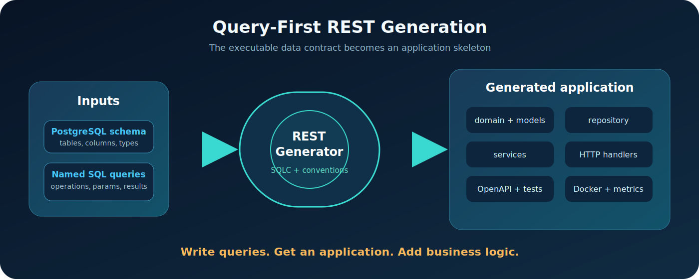

# Query-First: как получить REST-приложение из схемы PostgreSQL и SQL-запросов


> **Write queries. Get an application. Add business logic.**

Когда мы начинаем новый backend, довольно быстро появляется знакомый список дел:

- описать модели;
- написать repository;
- добавить service;
- создать HTTP handlers;
- не забыть request/response DTO;
- провести типы через все слои;
- описать OpenAPI;
- написать хотя бы базовые тесты;
- собрать Dockerfile, health check, логирование и конфигурацию.

А затем повторить всё это для следующей таблицы. И ещё раз. И ещё двадцать семь раз.

В какой-то момент разработчик начинает подозревать, что значительная часть его работы могла бы выполняться компьютером. Компьютер, в свою очередь, уже несколько часов без дела греет комнату.

Так появился **REST**: CLI на Go, который строит REST-приложение поверх PostgreSQL и SQLC. Но интереснее самого генератора его исходная идея: **Query-First**.

В этой статье я покажу, что это за подход, чем он отличается от spec-first и code-first, что уже умеет проект, где у него настоящие преимущества и где заканчивается автоматизация и начинается работа разработчика.

## Три возможные точки старта

В REST-разработке обычно обсуждают два подхода.

### Spec-first

Сначала создаётся OpenAPI-спецификация, затем по ней генерируются серверные интерфейсы, клиенты или часть прикладного кода.

```text
OpenAPI → server interfaces → implementation → database
```

Это хороший выбор, когда публичный HTTP-контракт первичен: например, над API одновременно работают несколько команд или его заранее согласуют с внешними потребителями.

Но спецификация сама не выполняет запросы к базе. Между описанием endpoint и реальным поведением приложения остаётся достаточно много ручной реализации.

### Code-first

Сначала пишутся модели, handlers и аннотации, а документация выводится из кода.

```text
application code → OpenAPI
```

Подход удобен, когда серверный код является главным источником истины. Однако модели хранения, транспортные модели и запросы к данным могут начать жить немного разными жизнями.

### Query-first

В REST исходным исполняемым контрактом становятся:

- схема PostgreSQL;
- именованные SQL-запросы;
- типы и сигнатуры, полученные через SQLC;
- явные соглашения об именовании.

```text
PostgreSQL schema + named SQL queries
                    ↓
             typed contract
                    ↓
 domain → repository → service → HTTP
                    ↓
       OpenAPI + tests + infrastructure
```



Схема описывает, **какие данные существуют**, а запросы — **какие операции приложение действительно умеет выполнять**.

Это не попытка объявить SQL новым языком описания всего мироздания. Это способ автоматически построить большую механическую часть backend вокруг уже существующего слоя данных.

## Пример: от SQL до работающего endpoint

Возьмём таблицу медицинских исследований:

```sql
CREATE TABLE studies (
    id              UUID PRIMARY KEY DEFAULT gen_random_uuid(),
    created_at      TIMESTAMPTZ NOT NULL DEFAULT now(),
    updated_at      TIMESTAMPTZ NOT NULL DEFAULT now(),
    patient         TEXT NOT NULL,
    study_type      TEXT NOT NULL,
    time_beginning  TIMESTAMP,
    surgeon         TEXT NOT NULL,
    dicom_link      TEXT,
    deleted         BOOLEAN NOT NULL DEFAULT FALSE
);
```

Добавим запрос с необязательными фильтрами:

```sql
-- name: GetStudies :many
SELECT * FROM studies
WHERE deleted = false
  AND (
    sqlc.narg('date')::timestamp IS NULL
    OR time_beginning::date = sqlc.narg('date')::date
  )
  AND (
    sqlc.narg('type')::text IS NULL
    OR study_type = sqlc.narg('type')
  )
  AND (
    sqlc.narg('surgeon')::text IS NULL
    OR surgeon = sqlc.narg('surgeon')
  )
ORDER BY time_beginning DESC;
```

SQLC превращает его в типизированный Go-метод и структуру параметров. REST читает схему, SQLC-запросы и сгенерированные сигнатуры, после чего создаёт:

```http
GET /studies?date=2026-06-18&type=CT&surgeon=Ivanov
```

Параметры из `sqlc.narg(...)` становятся необязательными query parameters. Тип даты попадает в Go-модели и OpenAPI. Результат `:many` становится массивом response-моделей.

Другой запрос:

```sql
-- name: GetStudyByPatient :one
SELECT * FROM studies
WHERE patient = $1 AND deleted = false;
```

превращается в:

```http
GET /studies/patient/{patient}
```

А этот:

```sql
-- name: UpdateStudyDicomLink :one
UPDATE studies
SET dicom_link = $2, updated_at = NOW()
WHERE id = $1 AND deleted = false
RETURNING *;
```

даёт:

```http
PATCH /studies/{id}/dicom-link
Content-Type: application/json

{
  "dicom_link": "https://example.test/studies/123"
}
```

Здесь имя запроса — не косметика. Оно становится частью небольшого декларативного языка:

| Префикс запроса | HTTP-метод |
| --- | --- |
| `Get`, `List`, `Find`, `Search` | `GET` |
| `Delete`, `Remove`, `SoftDelete` | `DELETE` |
| `Update`, `Patch` | `PATCH` |
| остальные | `POST` |

Соглашения не заменяют полноценную HTTP-спецификацию, зато позволяют автоматически получить предсказуемый контракт без дублирования каждого запроса в нескольких файлах.

## Что появляется после одной команды

Базовый сценарий выглядит так:

```bash
make build-rest
./bin/rest init --example
./bin/rest generate
go test ./...
```

Если SQLC уже настроен:

```bash
./bin/rest init
# Настраиваем rest_config/sqlc_rest.yaml
./bin/rest generate
```

При генерации автоматически запускаются `sqlc generate` и `go mod tidy`.

На встроенном примере текущая версия создаёт семь прикладных routes:

```text
POST   /studies
GET    /studies
DELETE /studies
GET    /studies/{id}
DELETE /studies/{id}
GET    /studies/patient/{patient}
PATCH  /studies/{id}/dicom-link
```

Кроме routes создаются:

```text
cmd/main.go
internal/app/domain
internal/app/repository/pgrepo
internal/app/services
internal/app/transport/httpmodels
internal/app/transport/httpserver
docs/swagger.yaml
curl/study.md
Dockerfile
```

В зависимости от конфигурации добавляются:

- Swagger UI;
- handler tests;
- curl-примеры;
- zap logging;
- Prometheus-совместимые метрики;
- request ID, CORS и panic recovery;
- ограничение размера request body;
- health endpoint;
- graceful shutdown;
- начальная Goose migration;
- `.env.example`, Makefile и `init_db.sh`;
- GitHub Actions для CI/CD.

На моей локальной проверке генерация встроенного примера заняла около **0,6 секунды** без учёта сборки самого CLI. Это не универсальный benchmark, но хорошо показывает масштаб: генератор тратит меньше времени, чем разработчик выбирает название для очередного `StudyResponse`.

## Почему выигрыш растёт вместе с проектом

На одной таблице можно сказать: «Я и руками быстро напишу».

И это правда.

Но стоимость ручной работы почти линейно растёт вместе с количеством:

- таблиц;
- запросов;
- фильтров;
- request/response моделей;
- handlers;
- тестов;
- OpenAPI operations.

Генератору почти всё равно, обрабатывает он пять запросов или сто пять. Поэтому особенно заметный эффект появляется в проектах с большим количеством моделей и уже известным набором SQL-операций.

Query-First устраняет несколько классов повторения:

1. Тип поля не нужно вручную переносить из PostgreSQL в repository, domain, DTO и OpenAPI.
2. Параметры запроса не нужно независимо описывать в SQL, handler и документации.
3. Новый именованный запрос сразу получает одинаковую архитектурную обвязку.
4. Все endpoints строятся по одним правилам, а не по настроению автора конкретного файла в конкретный вторник.

Главное обещание проекта звучит так:

> REST превращает схему PostgreSQL и именованные SQL-запросы в готовый к развитию REST-сервис. За секунды он создаёт предсказуемую архитектуру, типобезопасный доступ к данным, endpoints, OpenAPI, тесты и инфраструктуру, оставляя разработчику бизнес-специфическую логику.

## Это не low-code и не замена разработчика

У генераторов есть опасная маркетинговая привычка: демонстрация заканчивается ровно перед первым реальным бизнес-требованием.

REST не пытается притворяться системой, способной понять предметную область из названия колонки.

Он создаёт хороший стартовый скелет и берёт на себя механическую работу. Пользователю всё равно предстоит писать:

- сложную бизнес-валидацию;
- межсервисные сценарии;
- доменные правила;
- нестандартное преобразование ответов;
- интеграции с внешними системами;
- специфическую обработку ошибок.

Если пациент не может быть записан на две операции одновременно, это бизнес-правило. SQL-тип `timestamp` нам об этом не расскажет, как бы выразительно мы на него ни смотрели.

## Честные ограничения текущей версии

На момент написания статьи основной реализованный путь — **Go + PostgreSQL + SQLC**.

Есть и другие ограничения:

- HTTP-метод и route частично выводятся из имени запроса;
- не все конструкции production-схем PostgreSQL уже поддерживаются parser’ом;
- сложные constraints, defaults и несколько схем требуют дальнейшего покрытия;
- generated handlers сейчас используют базовую семантику статусов, например успешное создание возвращает `200`, а не настраиваемый `201`;
- сложная валидация остаётся пользовательским кодом;
- обновление ранее сгенерированного проекта — отдельная сложная задача для любого code generator.

Для защиты пользовательских изменений есть `safe_reload`: перед повторной генерацией инструмент сравнивает файлы с предыдущим снимком и предлагает сохранить изменённую пользователем версию или заменить её.

Это полезная страховка, но хорошая архитектурная граница между generated и custom code всё равно остаётся важнее любой страховки.

### Rate limiting

Rate limiting присутствует в проектируемом auth-контракте, но middleware для реально генерируемого HTTP-приложения **ещё не реализован**. Это часть roadmap, а не текущая возможность.

Такое уточнение кажется мелочью ровно до момента, когда статью открывает человек с `rg` и свободным вечером.

## Авторизация и аутентификация: следующая глава

В проекте уже существует конфигурационный контракт будущего auth generator: identity model, стратегии аутентификации, cookies, refresh tokens, API keys, роли, политики доступа, audit log и rate limiting.

Но генерация этой логики пока намеренно отключена. После реализации Query-First сможет дополнить SQL-операции информацией о том:

- является endpoint публичным или защищённым;
- какие роли и permissions нужны;
- какая authentication strategy используется;
- какие security schemes должны попасть в OpenAPI;
- какие ограничения применяются к чувствительным операциям.

Это заслуживает отдельной технической статьи после появления работающего end-to-end сценария. Пока честная формулировка проста: **контракт спроектирован, реализация впереди**.

## MongoDB: второй источник данных

MongoDB также присутствует в проекте как будущий конфигурационный контракт, но generator пока не реализован.

Интересная задача здесь — сохранить саму идею Query-First, когда вместо SQL появляются именованные операции над коллекциями, aggregation pipelines и схемы валидации документов.

Эту главу имеет смысл подробно раскрыть после того, как MongoDB-путь будет генерировать приложение и проходить те же end-to-end проверки, что PostgreSQL/SQLC.

## Транзакции между несколькими операциями

Один SQLC-запрос хорошо отображается в одну прикладную операцию. Реальный бизнес-сценарий часто требует нескольких запросов в одной транзакции:

```text
создать заказ
→ зарезервировать остатки
→ записать платёжную попытку
→ сохранить audit event
```

Будущее расширение может позволить декларативно группировать запросы в transactional workflow, а генератор создаст orchestration/service-слой с `BEGIN`, `COMMIT` и `ROLLBACK`.

Но здесь особенно важно не торопиться: транзакция — это уже не только техническая обвязка, но и часть бизнес-семантики. Поэтому сейчас такие сценарии логично реализовывать custom-кодом, а подробную главу оставить до появления устойчивого контракта.

## Query-First не обязан воевать со Spec-First

Название нового подхода легко провоцирует архитектурный турнир, но на практике подходы могут дополнять друг друга.

Например:

1. На раннем этапе Query-First быстро создаёт работающий внутренний API из реальных запросов.
2. Команда уточняет бизнес-семантику и стабилизирует routes.
3. Сгенерированный OpenAPI становится контрактом для frontend или внешних клиентов.
4. Для публичной версии API команда вводит явные overrides и правила совместимости.

Query-First особенно силён там, где данные и операции над ними уже известны, а ручное построение стандартного backend вокруг них не создаёт дополнительной бизнес-ценности.

## Что я хочу проверить вместе с сообществом

Проект уже умеет генерировать рабочий PostgreSQL/SQLC-путь, но концепция ещё развивается. Мне особенно интересна обратная связь по следующим вопросам:

- Достаточно ли соглашений об именовании или нужны явные SQL-аннотации для method/path/status?
- Где должна проходить граница между generated и custom code?
- Как лучше описывать транзакционные workflows?
- Какие PostgreSQL-типы и конструкции важнее всего поддержать следующими?
- Нужен ли режим строгого API-контракта поверх Query-First?

Репозиторий: [github.com/repomz/rest](https://github.com/repomz/rest)

Если идея кажется полезной, можно запустить встроенный пример, посмотреть generated code и открыть issue с неудобным реальным запросом. Именно неудобные запросы обычно лучше всего объясняют генератору, что жизнь сложнее его тестовых fixtures.

## Вместо заключения

Query-First не обещает создать за вас готовый бизнес.

Он обещает более практичную вещь: взять существующую схему, реальные запросы и за секунды построить вокруг них согласованный, типобезопасный и понятный REST-скелет.

Разработчик получает не пустую директорию и не абстрактный tutorial, а приложение, которое уже можно запускать, проверять, обсуждать и постепенно превращать в продукт.

> **Write queries. Get an application. Add business logic.**
